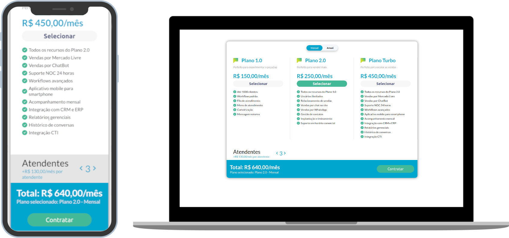

<p align="center">
    <a href="https://desafio-vulcanet.herokuapp.com/"><a/>
</p>
    <h1 align="center">Desafio Vulcanet</h1>

<h4 align="center">
  Seletor de planos utilizando arquitetura FLUX
</h4>
<p align="center">
  

  
  
  <a href="https://github.com/KZTN/Desafio_Vulcanet/commits/master">
    
  </a>

  <a href="https://github.com/KZTN/Desafio_Vulcanet/issues">
    
  </a>

  
</p>
<p align="center">
  
</p>

## ℹ️  Informações

Este é um desafio que faz parte do recrutamento da Vulcanet. O projeto já está finalizado e funcional.


## 💻 Projeto

O projeto exibe planos para que o usuário possa fazer sua customização de preferência e valores. Foi utilizado redux para manipulação dos dados.

## Começando...
Essas instruções fornecerão uma cópia do projeto em execução na sua máquina local para fins de desenvolvimento e teste.

### Pré-requisitos
O que você precisa para instalar o software:

```
node v12.x
yarn 1.22.4
git
```

### Instalando o projeto 🚀
Clonando o projeto:

```
git clone https://github.com/KZTN/Desafio_Vulcanet.git
```

Navegando até a pasta do projeto:

```
cd Desafio_Vulcanet
```


Baixando as dependências do projeto:

```bash
yarn install
```

Rodando o projeto:

```bash
yarn start
```

Visite http://localhost:3000 para ver o resultado. 🎉

## :memo: Licença

Esse projeto está sob a licença MIT. Veja o arquivo [LICENSE](LICENSE.md) para mais detalhes.
